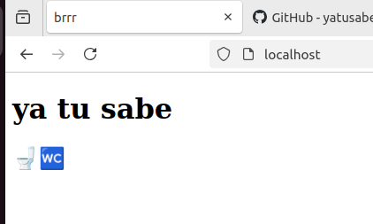

# Fundamentos de contenerización - Servidor Web Simple con Nginx

## Paso 1: Construcción de la imagen
``` bash
sudo docker build -t 118fcproyecto1:1.0 .
```
 
## Paso 2. Ejecutar el contenedor en el puerto 80, 100fcproyecto1 
``` bash
sudo docker run -d -p 80:80 --name 118fcproyecto1 118fcproyecto1:1.0
```
 
## Paso 3. Comprobación: http://localhost 

 
## Paso 4. Se pide modificar el fichero index.html desde el contenedor. 
Se hace haciendo:
``` bash
sudo docker exec -it 118fcproyecto1 bash
```

Y dentro hacemos uno de estos 2 (pero la maquina no los tiene):
``` bash
nano /usr/share/nginx/html/index.html
vi /usr/share/nginx/html/index.html
```

